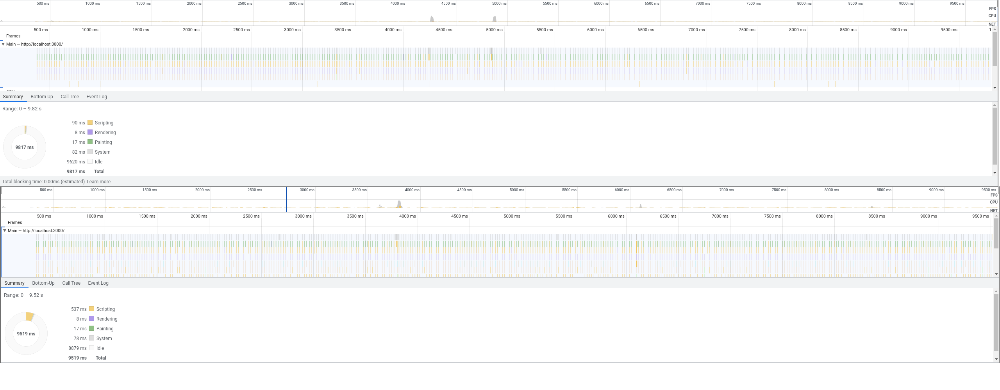
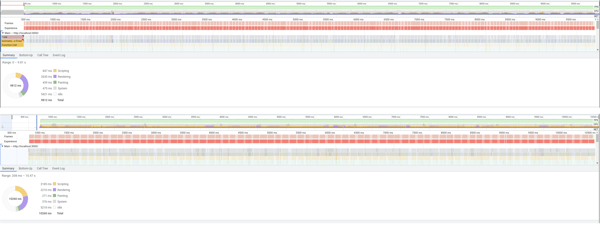

what happens if we bounce css custom properties through js? Lets find out!

(see the profiler dump json files for raw data)

Why? Because I want to rebuild buntpapier to style like this and I can't wait for houdini to finish in 2042:

```css
#btn-cta {
	--color: var(--clr-primary);
	--size: huge;
}
```

Currently, this happens via stylus mixins:

```stylus
#btn-cta
	button-style(color: $clr-primary, size: huge)
```

# Idling


# Animating the parent custom property with requestAnimationFrame

